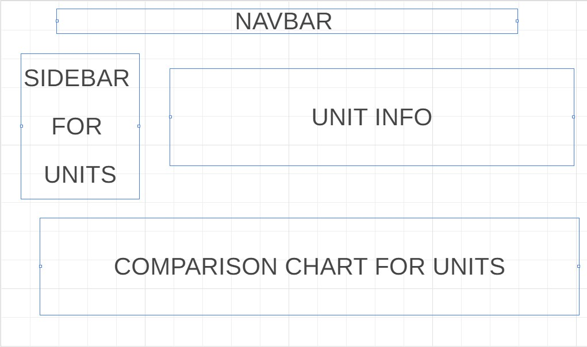

# TFT-Academy-App
- TFT Academy App is an interactive sheet of data that holds information for all the units of the new set in Riot Games Autobattler game TeamFight Tactics. One tab will include data from whichever unit you wish to see, from their traits, abilities and stats on each upgrade. TFT Academy shows the user all the units in a sidebar. From all these units, they can click one and all of that units'data will be displayed on the right. Along with this, there will be a chart that will prompt the user to click a listed stat, that will then display a chart of all the units ordered by that stat from either ascending or descending order.
- A second tab will render an empty grid that will allow the user to place the units onto the board essentially creating a custom team of units they like. The board will update its statistics dynamically depending on the unit the user wishes to place onto it. This will allow the user to theorycraft and view builds before testing them out in the real game.
 
## Wireframe

## Functionalities
In TFT Academy, users will be able to see stats on any unit they want and how each unit is compared to others via a chart. They will also be able to visualize any builds they would like via a team builder.
- Click on a navbar
- They can scroll through a sidebar of icons that represent units
- The sidebar can be filtered and searched through
- Clicking a unit will display all of their abilties and stats
- A chart on the bottom will display if a filter is clicked
- Place and remove units on an empty board

## Technologies and Libraries used
This project will be implementing 
- a json file to fetch data [https://raw.communitydragon.org/13.1/cdragon/tft/en_us.json](https://raw.communitydragon.org/13.1/cdragon/tft/en_us.json)
- D3 api to render a graph
- webpack and npm to bundle js files

## Implementation Timeline:
- Friday - I will be setting up my project and dedicate myself to render a single units data throughout the page.
- Weekend - Implement sidebar to hold all units and change rendered data to whichever is clicked
- Monday - Dedicate myself to add filtering logic and rendering a graph for the units stats
- Tuesday - Add a new tab in nav bar to create an interactive grid that can allow for units to be placed on
- Wednesday - Allow for grid to update statistics dynamically as units are put on it.
- Thursday - Polish and push to git up and present.