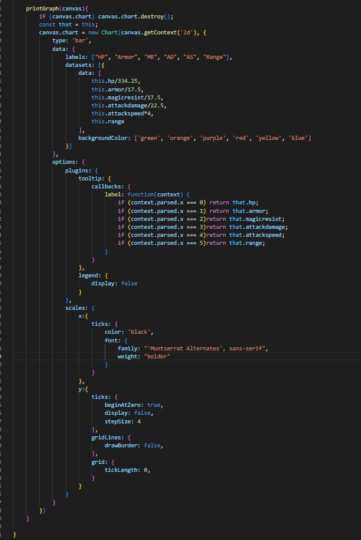
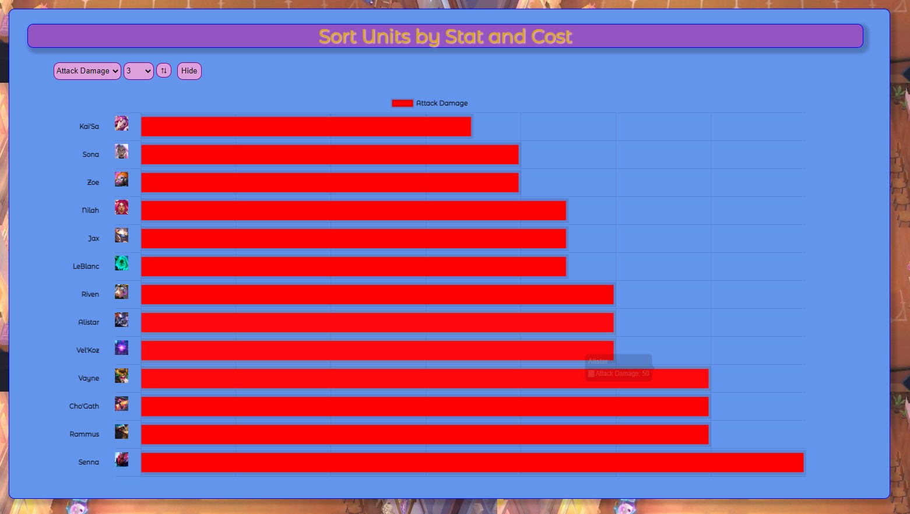
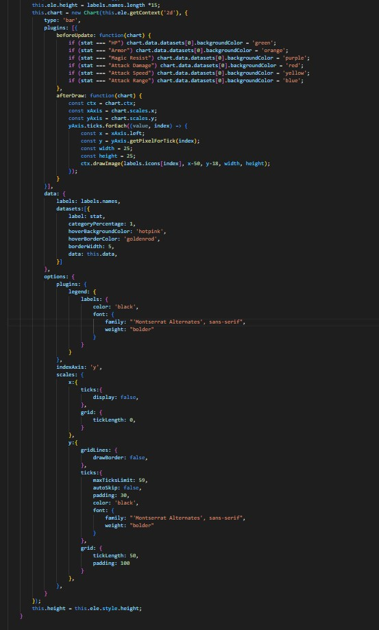
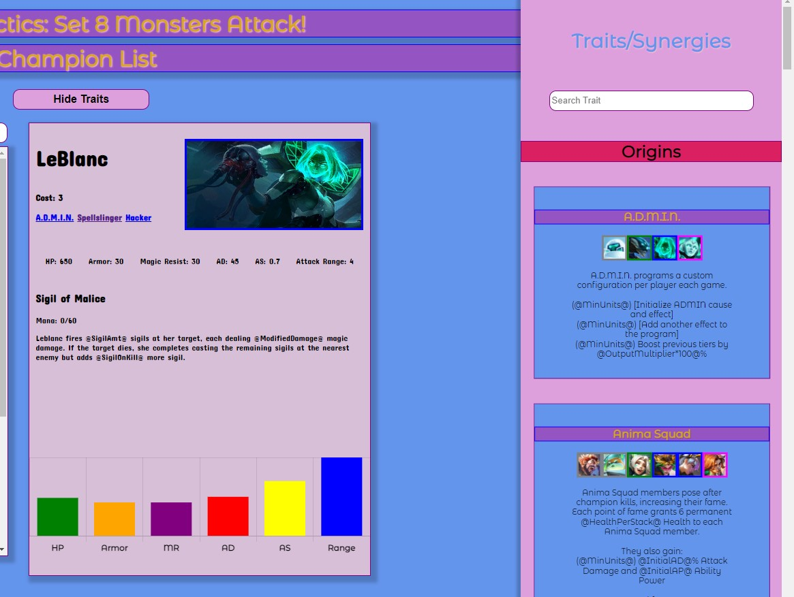
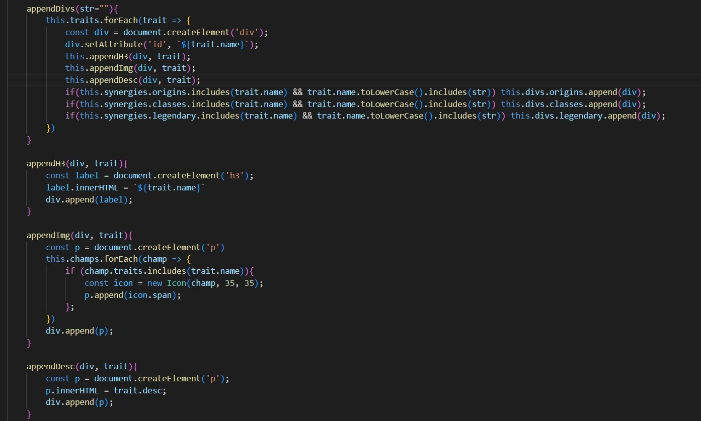

# Tacticspedia
- Tacticspedia is an interactive sheet of data that holds information for all the units of the new set in Riot Games Autobattler game TeamFight Tactics. The main page will include data from whichever unit you wish to see, from their traits, abilities and stats. Tacticspedia shows the user all the units in a scrollbar. From all these units, they can click one and all of that units'data will be displayed on the right. Along with this, there will be a chart that will prompt the user to click a listed stat, that will then display a chart of all the units ordered by that stat from either ascending or descending order and can be filtered by the units tier or cost. Each unit has a trait, each with special properties. Tacticspedia will show all the traits in the game and their information in a collapsable sidebar that can be searched through.
 
## Wireframe

## Functionalities
In TFT Academy, users will be able to see stats on any unit they want along with their traits and how each unit is compared to others via a chart. 
- They can scroll through a scrollbar of icons that represent units.
- Clicking a unit will display all of their abilties and stats.

- A chart on the bottom will display if a filter is clicked.

- A collapsable sidebar for the units traits can be opened with a button.

- Both sidebar and scrollbar can be searched through via search bar.

## Technologies and Libraries used
This project will be implementing 
- a json file to fetch data [https://raw.communitydragon.org/13.1](https://raw.communitydragon.org/13.1)
- an api from data dragon maintained by Riot Games [https://ddragon.leagueoflegends.com/cdn/13.1.1](https://ddragon.leagueoflegends.com/cdn/13.1.1)
- chart.js library to render graphs
- webpack and npm to bundle js files

## Implementation Timeline:
- Friday - I will be setting up my project and dedicate myself to render a single units data throughout the page.
- Weekend - Implement sidebar to hold all units and change rendered data to whichever is clicked.
- Monday - Dedicate myself to add filtering logic and rendering a graph for the units stats.
- Tuesday - Add a collapsable sidebar that holds all information on traits and synergies of the units.
- Wednesday - Style everything and make everything look nice, add minor functionalities I might find interesting.
- Thursday - Polish and push to git up and present.

